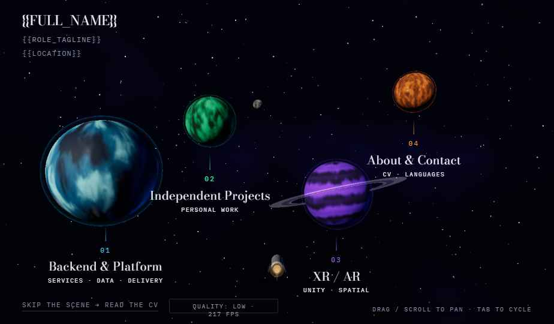
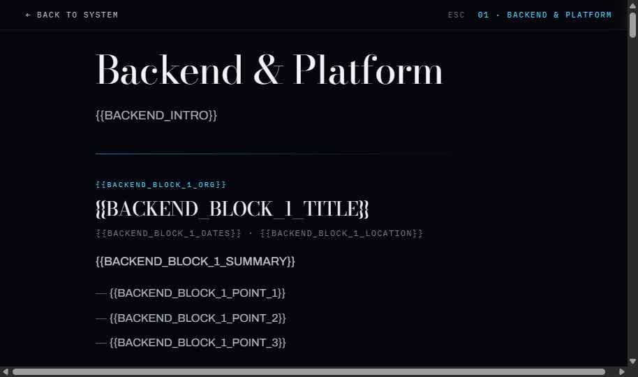

# personal-website

A personal portfolio built as a cinematic space scene. Four planets drift in a
starfield; each one is a section of a CV. Click a planet and a ship flies out,
the screen washes to lightspeed, and the site decelerates onto that destination
— a full-screen panel whose top 44 vh stays transparent, so the planet you just
flew to frames the page and parallaxes as you scroll.

**Live:** <https://wallerthedeveloper.github.io/personal-website/>



## Two editions of the same site

Everything is one document, one WebGL context, no backend.

- **The scene** — three.js hub with four destinations (`#backend`, `#projects`,
  `#xr`, `#about`). Panels are overlays, never separate pages, so navigating
  never tears down the renderer or re-bakes a planet texture.
- **The text edition** — the complete CV as flat, scrollable HTML. It is the
  **default** state the document ships in: a head probe fades it out only once
  it knows WebGL can run. No JavaScript, no WebGL, a crawler, or a print dialog
  all get the whole site, and `Ctrl+P` flattens all four panels into one
  continuous document.



## Stack

| | |
| --- | --- |
| Build | Vite 6, single HTML entry, static `dist/` |
| Language | TypeScript, `strict` |
| 3D | three.js, pinned to 0.160.x |
| Framework | None. Vanilla DOM, hash routing, no state library |
| Styles | Hand-written CSS with custom properties, one `styles.css` |
| Fonts | Bodoni Moda · Archivo · IBM Plex Mono, from the Google Fonts CDN |
| Tests | Vitest (unit, incl. a transfer-budget check on the built artifact) · Playwright (E2E, incl. axe a11y and draw-call budgets) |
| Hosting | GitHub Pages, deployed by Actions on push to `master` |

No framework is a deliberate choice, not an omission: the site is one page with
four overlay panels and a WebGL context that must never be unmounted. A
component lifecycle is a liability there.

Planet surfaces are **generated at runtime** — domain-warped FBM, ridged noise
and 3D worley craters, baked once at init — so the repo ships no texture files.
Total transfer stays under 900 KB, of which `three` is nearly all.

## Quick start

Node 20+ (CI builds on 24).

```bash
npm install
npm run dev          # http://localhost:5173
```

| Script | What it does |
| --- | --- |
| `npm run dev` | Vite dev server |
| `npm run build` | `tsc --noEmit` then `vite build` → `dist/` |
| `npm run preview` | Serve the built `dist/` |
| `npm run typecheck` | Types only |
| `npm test` | Vitest unit suite — also builds the site to a temp dir and asserts the transfer budget |
| `npm run test:e2e` | Playwright E2E |

Run the E2E suite with `npx playwright test --workers=3`. At the default worker
count the suite is flaky under software WebGL and reports failures that are not
real.

## Layout

```
index.html            the one document: head probe, hub chrome, four panels, text edition
src/
  main.ts             entry — boots the router
  router.ts           hash routing, the jump, panel lifecycle
  project-detail.ts   the #projects/pN dialog: focus trap, video facades
  hub.ts              scene setup, camera, input, hover, park/unpark
  engine/             planet meshes, texture baking, shaders, sky, ship, capability tiers
  warp.ts             the hyperspace cover
  loading-ring.ts     determinate boot dial
  boot-progress.ts    streams the engine chunk for a real byte count
  labels.ts           projected planet labels
  head.ts             title and meta tokens
  jump-guard.ts       jump serialisation
  analytics.ts        optional Umami hook
  content.ts          every visible string
  styles.css
build/copy-tokens.ts  Vite plugin: substitutes content.ts into the HTML, and
                      inlines content/projects/pN.html, both at build time
build/project-tags.ts Vite plugin: renders the tech tag rows from simple-icons
build/engine-chunk.ts Vite plugin: writes the hashed engine chunk URL into the head
content/projects/     the owner's authored project bodies, one HTML file each
tests/unit  tests/e2e
public/               cv.pdf, og.png, robots.txt, sitemap.xml, models/, projects/
design/               the reference prototype and its notes
```

## Routes

`#backend`, `#projects`, `#xr`, `#about` — and no hash for the hub. The Projects
panel adds one sub-route, `#projects/pN`, which opens that project's detail as a
centred dialog over the card grid. It is deep-linkable: Back closes the dialog
and returns to `#projects`, Escape closes the dialog and a second Escape exits to
the hub.

Everything that turns a detail into a dialog is gated on `html[data-dg-3d]`, so
the text edition and the printed CV render all four details inline, under their
own cards, with no JavaScript.

Every project has **two** video facades — one on its card, one in its detail. The
markup carries only a plain link to YouTube; the card's thumbnail is fetched when
the Projects panel is first reached and the detail's when the detail opens, and
the `youtube-nocookie` player is mounted only after a click on play. The site
makes no third-party request until then, and none at all from the hub.

The card is a container, not a link: an interactive player inside an `<a>` is
invalid HTML and an axe `nested-interactive` failure. The player sits beside one
`.card__link` that wraps the title, summary, tag row and "View details →".

Closing a detail, leaving the panel, `flatten()` and Escape all remove every
player node in the panel. Removing the node is the only thing that stops the
audio — `pause()` needs the iframe player API, and a hidden iframe keeps playing.

## Content

Every visible string lives in `src/content.ts`. The markup carries `{{TOKEN}}`
placeholders that `build/copy-tokens.ts` substitutes **at build time**, so the
served HTML carries the real copy with JavaScript disabled — which is what keeps
the text edition complete.

Two things in the Projects panel are built rather than tokenised, for the same
reason and at the same moment:

- **The project detail bodies** are freeform HTML the owner writes, one file per
  project in `content/projects/`, inlined raw into `[data-body]`.
  `content/projects/README.md` documents what is allowed;
  `tests/unit/authored-html.test.ts` enforces it.
- **The tech tag rows** are rendered by `build/project-tags.ts` from
  `PROJECT_DETAILS` in `content.ts`, with brand marks resolved out of
  `simple-icons` — a **devDependency**, so the glyphs ship as inline paths and no
  icon library reaches the browser. A brand the set has no mark for (C#, OpenXR,
  GLSL, Protocol Buffers) renders as a text-only chip; an unknown slug fails the
  build.

Each token still defaults to the literal `{{TOKEN}}` string it replaces, so an
unfilled site reads the same either way; filling the CV means editing
`src/content.ts` and nothing else. Unit tests keep the table and the markup in
step — a token in one and not the other fails the build, and an unknown token in
the HTML throws during substitution rather than shipping as visible braces.

Editorial rules that the design depends on (the Projects panel's own-initiative
notice, the single employment treatment on the XR panel, the two skills groups)
are documented in [CLAUDE.md](CLAUDE.md).

## Analytics

Off by default. `src/analytics.ts` is a no-op unless both `VITE_UMAMI_SRC` and
`VITE_UMAMI_ID` are set — see [.env.example](.env.example). Umami's automatic
pageviews are disabled on purpose: after the first load this document never
loads again, so views are sent explicitly on each completed jump.

## Deployment

`.github/workflows/deploy.yml` runs on push to `master`: `npm ci`, `npm test`,
`npm run build`, then publishes `dist/` to GitHub Pages.

This is a **project** site, served from `/personal-website/`, so
`vite.config.ts` sets `base` to that path for builds only — dev and preview stay
rooted. With a root base every asset URL resolves to the host root, 404s, and
strands the live page on the text edition; `tests/unit/build-artifact.test.ts`
pins it.

Moving to an apex domain later means restoring `public/CNAME`, setting `base`
back to `/`, and updating the origin in `index.html`, `src/content.ts`,
`public/robots.txt`, `public/sitemap.xml` and the two tests that pin it.

## Further reading

- [CLAUDE.md](CLAUDE.md) — the invariants: what must not change in the router, the engine, or the editorial rules, and why.
- [design/DESIGN_SPEC.md](design/DESIGN_SPEC.md) — measurements of record: tokens, type, every panel's composition, motion timings, budgets.
- [design/BUILD_NOTES.md](design/BUILD_NOTES.md) — the original build notes, including the bugs each invariant exists to prevent.
- [design/index.dc.html](design/index.dc.html) — the reference prototype. Serve it over HTTP (`cd design && npx serve .`); `file://` blocks its ES-module imports.
